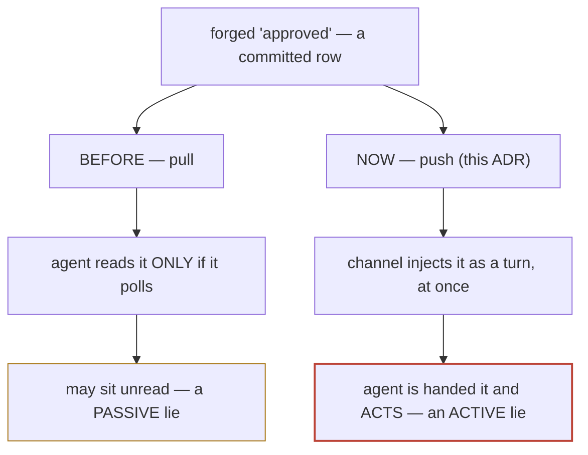
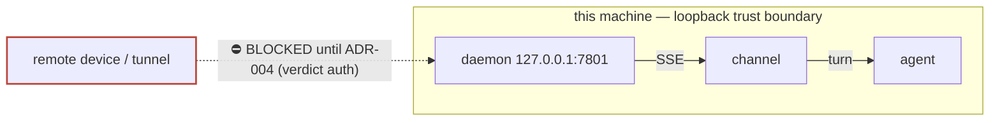

# ADR-007: Channel threat model — accept the dev channel locally, gate remote on ADR-004

**Status:** proposed · **Date:** 2026-07-17 · **Project:** librarian · **Read time:** ~3 min

## TL;DR

- **Decision:** keep the channel push path + `--dangerously-load-development-channels` for **local, single-user** work.
- **The one hard gate (⛔):** the daemon stays **loopback-only until ADR-004 (verdict auth) ships.** No tunnel, no public bind, while the channel is live.
- **Why now:** push delivery changes what a *forged* verdict does — see the picture below.

## The point, in one picture

Delivery went pull → push. Same forged verdict, two very different fates:

The channel adds **no new external attack surface**. What it does is raise the
blast radius of the gap we already knew about (F1 / ADR-004): a forged verdict
stops being a note the agent *might* read and becomes an instruction it *executes*.

## Where the danger lives (and the gate)

Today the trust boundary is **any process running as you, on this machine** — the
same trust you already give your shell and the SQLite store. The channel does not
widen it. The ⛔ gate keeps it that way: nothing remote reaches the daemon until a
verdict authenticates under *your key*, not the transport.

## Threats (severity for local, single-user, loopback)

- **T1 ⛔ — a verdict trusts the transport, not the message** (F1 / ADR-004). `postVerdict` treats `by` as an unverified label. Today: low (local only). **CRITICAL the moment the daemon is reachable off-box — the hard blocker for going remote.**
- **T2 — injection via the free-text reason**, which flows verbatim into the agent's turn. Today: low (the channel labels it "data, not instructions"; the author is you). **HIGH combined with T1.**
- **T3 — the dev flag fully trusts the named server.** Today: low (it is our own code). High if an untrusted server is ever named.
- **T4 — `/api/events` is unscoped**: every connected agent sees every verdict. Today: low (one user). **Blocks v2** — multi-device must scope per participant.
- **T5 — the agent cannot tell a genuine turn from a forged one.** Same root as T1; fixed by ADR-004.
- **T6 — the channel goes down.** Non-issue by design: a drop costs *latency, not correctness* — the verdict is still a committed row readable via `get_review`.

## Decision — accept, with four conditions (the first is the gate)

1. **⛔ Loopback until ADR-004.** Verdict auth is a prerequisite for *any* remote exposure with the channel live.
2. **Only trusted, self-registered servers** get the dev flag — never a third-party server.
3. **Keep the "reason is data" framing** (defense-in-depth, not a guarantee).
4. **v2 must scope `/api/events`** per participant before a second device or user.

## Revisit if…

Daemon exposed beyond loopback · a second device or user · any non-`librarian` server named as a channel · the `claude/channel` protocol changes (research preview) · ADR-004 ships (retires T1/T5, unlocks remote).

**Related:** ADR-002 (delivery) · ADR-003 (owns T4 + mailbox) · **ADR-004 (closes T1/T5 — the gate).**
