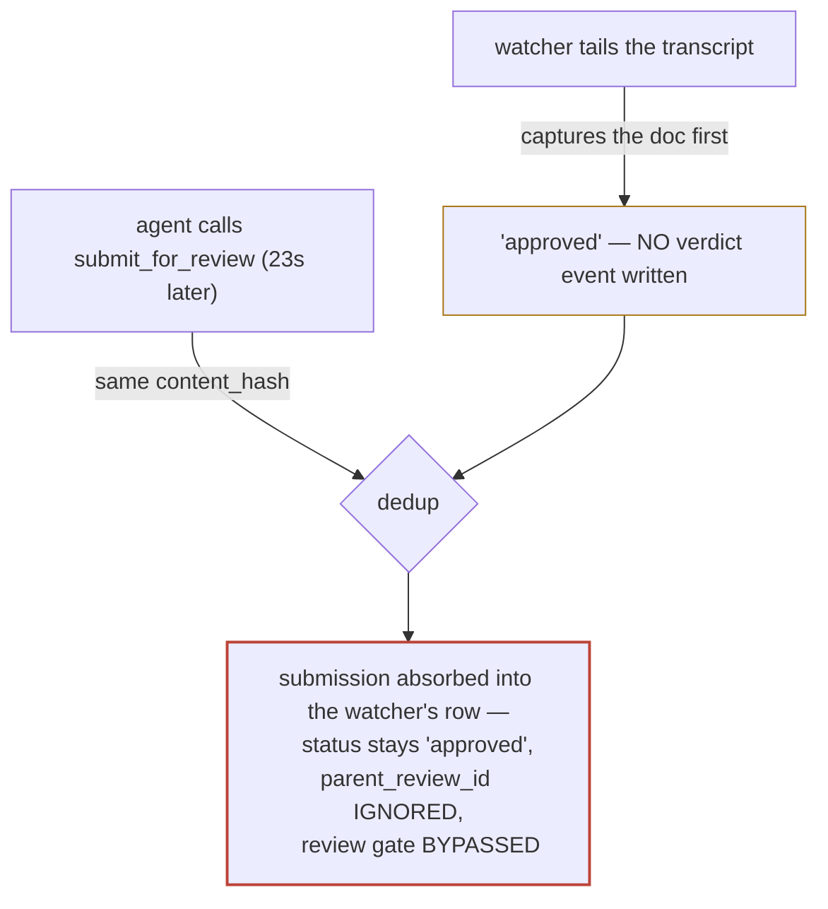

# ADR-008: The watcher records — it must never decide

**Status:** proposed · **Date:** 2026-07-17 · **Project:** librarian · **Read time:** ~4 min

## TL;DR

- ⛔ **Bug:** the transcript watcher stamps every capture `approved` with **no verdict event**, and content-hash dedup then lets those self-approved rows **swallow real reviews** — a `submit_for_review` can silently resolve to "approved" that no human ever gave.
- **Why it's critical:** `get_constraints` serves those fabricated approvals to agents as settled decisions. This breaks the project's core promise — *the library is the record of what the human decided.*
- **Proposed decision:** captures carry provenance, never authority. Only a verdict event may make a decision `approved`.
- **Proof by demonstration:** the watcher will capture this very document from the session transcript and mark it approved. Check its verdicts array: it will be empty.

## The failure, in one picture

The race is structural, not bad luck: the watcher tails the **same transcript
the submitting session is writing**, so the watcher's copy usually lands first
and owns the content hash.

## Evidence — one afternoon of dogfooding (2026-07-17)

Submitting ADR-007 for review produced four rows:

| decision | status | source | verdict events | what it really is |
|----------|--------|--------|----------------|-------------------|
| `dec_6bb025…` | `changes_requested` | mcp | 3 (all by the human) | the one genuine review |
| `dec_8b1d…` | `approved` | watcher | **none** | fabricated |
| `dec_1ff8a6…` | `approved` | watcher | **none** | fabricated |
| `dec_2a1bc…` | `approved` | watcher | **none** | fabricated — **and it hijacked the v3 resubmit**: provenance shows the watcher captured it 23s before the MCP submit, which then deduped into it |

Result: the genuine review is stuck at `changes_requested` and cannot receive
its revision — every resubmit is captured-then-hijacked. Meanwhile
`get_constraints` reports the fabricated rows under `accepted`.

## Root cause — two code sites

| # | Site | Defect |
|---|------|--------|
| 1 | `src/infrastructure/watcher/watcher.ts:193` | Every capture lands `initialStatus: 'approved'`, with no verdict event. The intent (comment: "filing them as pending would fill the queue") is right — the encoding is wrong. `approved` is a verdict; a capture is an observation. |
| 2 | `src/infrastructure/store/repository.ts:141-149` | Content-hash dedup runs **before** the `parentDecisionId` revision path and returns the existing row as-is. A gated `submit_for_review` that hash-matches a watcher row inherits `approved` and its `parent_review_id` is silently dropped. |

A subtlety worth keeping: the watcher's **plan captures** (`ExitPlanMode`
approvals) reflect a real human click — for those, "approved" is *observed*,
not fabricated. The **doc-write captures** (an agent writing an `.md` file)
reflect no ruling at all. The fix must distinguish them.

## Proposed decision (for review — not yet ruled)

**Principle: provenance is additive, authority is not. Only a verdict event —
a human ruling, or an observed human approval recorded AS a verdict event —
may put a decision in `approved`.**

1. **Doc-write captures carry no authority.** They enter the library as
   searchable records but are excluded from `get_constraints.accepted` and
   never satisfy a review. (Mechanism — distinct status vs. verdict-event-based
   filtering — decided at implementation; the invariant is what's binding.)
2. **Plan captures write the verdict they observed.** The human's
   plan-approval becomes a real verdict event attributed to the human, so the
   `approved` status is backed the same way every other approval is.
3. **Review intent beats dedup.** If `submit_for_review` hash-matches a
   decision that has **no human verdict event**, the submission's claim wins:
   the decision becomes `pending` and joins the review queue. Decisions with a
   real verdict dedupe as today.
4. **The thread beats the hash.** `parent_review_id` is honored **before**
   content-hash dedup, so a revision always reaches its own review thread.

## Consequences

- Fixes the trust invariant: `approved` in this library always means a human
  (or their observed click) said so — the empty-verdicts tell disappears.
- The review queue stays quiet: captures still skip it (condition 1), which
  preserves the original intent at `watcher.ts:193` without the forged status.
- Cleanup needed once shipped: today's fabricated `approved` rows
  (`dec_8b1d…`, `dec_1ff8a6…`, `dec_2a1bc…`) and any other watcher-sourced
  decisions with zero verdict events.

## Related

ADR-002 (verdict delivery) · ADR-004 (verdict authentication — same principle
one layer down: *authority comes from the message, never the transport;* here,
*authority comes from the verdict, never the capture*) · ADR-007 (channel
threat model — T1's blast radius makes fabricated approvals worse: a channel
pushes them into agents as instructions).
