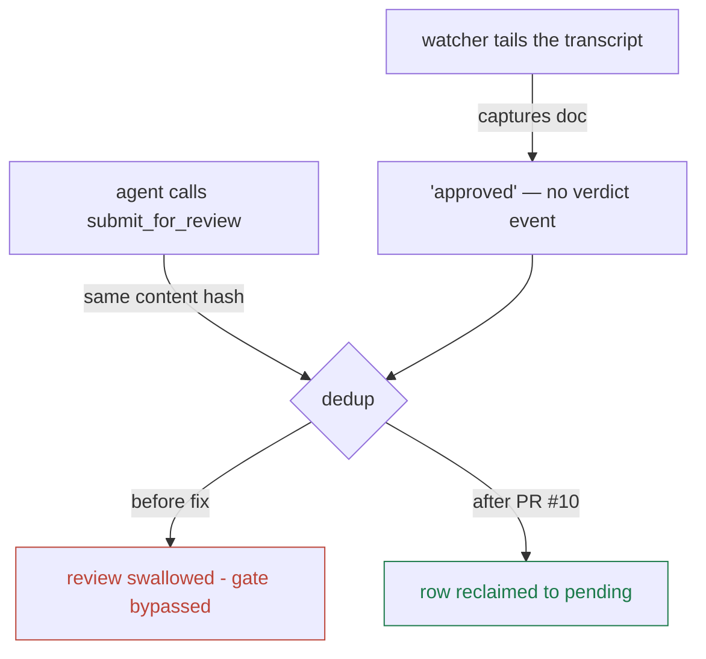

# ADR-009: Mermaid replaces ASCII diagrams in decision docs

**Status:** proposed (implementation shipped in PR #11 — approve to ratify, reject to revert) · **Date:** 2026-07-17 · **Project:** librarian · **Read time:** ~4 min

## TL;DR

- **Decision:** decision docs draw structure with **Mermaid** fences, not ASCII art. The three existing ASCII diagrams (ADR-007 ×2, ADR-008 ×1) get migrated.
- **The crux:** this only works if the review UI renders Mermaid — otherwise the place decisions are actually read shows raw diagram source. So the decision includes: **vendor a pinned `mermaid.min.js` into `public/` and lazy-load it** only when a doc contains a mermaid fence.
- **Why vendored, not CDN:** the review UI is the *verdict surface* — a script it loads can click "Approve." No runtime supply chain there. Vendoring also keeps the tool offline-safe.

## Why move off ASCII

ASCII diagrams were the right call *yesterday*: ADR-007 v3 used them precisely
because the UI's tiny renderer shows code fences faithfully and nothing else.
But they are the weakest part of every doc that carries them:

| | ASCII art | Mermaid |
|---|---|---|
| Authoring | hand-aligned whitespace; every edit re-draws boxes | declarative — nodes and arrows, layout is computed |
| Diffs | one label change touches many lines | one line per change |
| Rendering | monospace-dependent; breaks on wrap/mobile | real SVG, scales, theme-aware |
| GitHub | pre-block | **renders natively** |
| Claude artifacts | pre-block | **renders natively** |
| Agents | must re-draw art to revise a doc | edits the graph like code |
| Accessibility | screen-reader hostile | text source is structured |

The one place Mermaid loses today is our own review UI — which is exactly the
gap this ADR closes rather than designs around.

## Demonstration — ADR-008's race, redrawn

The same diagram that took ~20 hand-aligned ASCII lines:



**This renders as a real SVG right here in the review UI** — the rendering
shipped with this ADR's implementation (PR #11), alongside GitHub and
artifacts, which render mermaid natively. If you are seeing raw text instead,
that is a bug: report it, the design's contract is diagram-or-visible-source,
never silent breakage.

## Decision

1. **Mermaid is the diagram language for decision docs.** Structure, flow,
   sequence, state — all drawn as ` ```mermaid ` fences. ASCII art is retired
   for diagrams (tables and plain code fences are unaffected).
2. **The review UI renders it — vendored, pinned, lazy.**
   - `public/vendor/mermaid.min.js`, version-pinned, committed to the repo. No
     CDN: the review UI is the verdict surface (ADR-004's principle applies to
     its scripts, not just its callers), and the tool must work offline.
   - Loaded lazily, only when the rendered doc contains a mermaid fence — the
     library list and diagram-free docs stay dependency-free and instant.
   - Render failure degrades to what happens today: the source in a code
     fence, labeled as a diagram. A broken diagram never hides the doc.
3. **Migrate the three existing ASCII diagrams** (ADR-007's pull→push fates and
   trust boundary; ADR-008's capture race) in one pass. *Done in PR #11 —
   ADR-007 v4 verified rendering both as themed SVG in the review UI.*
4. **Authoring rule going forward:** if a diagram describes structure, it is
   Mermaid. ASCII survives only inside code fences that are literally about
   text layout (log excerpts, CLI output).

## Options considered

| Option | Verdict |
|---|---|
| **Vendored mermaid, lazy-loaded** | **Chosen** — offline-safe, no verdict-surface supply chain; measured cost: 3.4 MB in the repo (mermaid@11.16.0) |
| CDN `<script>` + SRI pin | Rejected: breaks offline, and the verdict surface should load zero remote code — SRI mitigates but the dependency remains |
| Keep ASCII everywhere | Rejected: fragile authoring, bad diffs, hostile to every renderer except monospace |
| Server-side render to SVG at submit time | Rejected for now: adds a daemon dependency and a build step for a browser-solvable problem; revisit if a non-browser surface (export, iOS) needs diagrams |

## Consequences

- **Costs:** 3.4 MB vendored asset in repo and npm package (measured, vs the
  ~2 MB estimated); one more thing to version-bump (pinned, deliberate updates
  only); docs with diagrams render a beat slower on first open (lazy load).
- **Buys:** diagrams become editable data instead of art; the same doc renders
  correctly in all four places it lives (review UI, GitHub, artifacts, export);
  agents can revise diagrams without redrawing them.
- **Unblocks:** richer doc types already planned (backend-plan-style sequence
  and UML views) inside the review flow instead of separate HTML files.

## Revisit if…

Mermaid's vendored size becomes a distribution problem (npm publish, gap 6) ·
a non-browser surface needs diagrams (server-side SVG option returns) · the
`md()` renderer is ever replaced wholesale (re-evaluate as part of that).

## Related

ADR-005 (clean architecture — the renderer stays an interface-layer concern) ·
ADR-007/ADR-008 (own the diagrams being migrated) · ADR-004 (the
no-remote-code-on-the-verdict-surface principle this extends).
