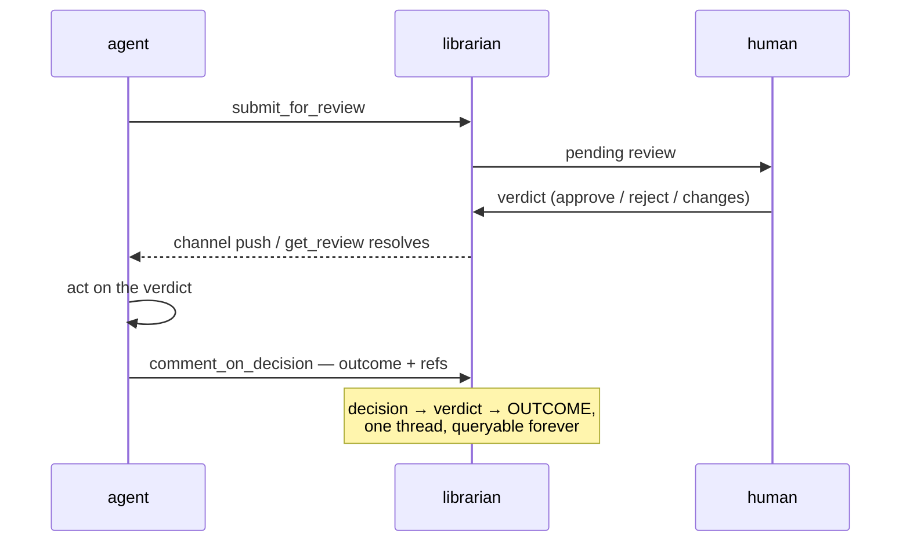

# ADR-010: The agent answers the verdict — every ruling gets an outcome comment

**Status:** accepted (2026-07-18, review `dec_503e264990e54e7ebd95`) · **Date:** 2026-07-18 · **Project:** librarian · **Read time:** ~3 min

## TL;DR

- **Decision:** after a human rules on a decision, the acting agent **must post a comment on that thread** recording what happened because of the ruling — acted, merged (with refs), reverted, or resubmitted.
- **Why:** today the thread ends at the verdict. What the agent *did about it* lives only in a chat transcript that gets compacted and lost. A decision's story is incomplete without its consequence.
- **The record becomes:** decision → verdict → **outcome**, all on one thread, forever queryable.

## The gap, concretely

ADR-009 was approved tonight. The approval is a verdict row; the *outcome* — "the
implementation had already shipped in PR #11, nothing further to build" — existed
nowhere in the library until the agent posted it by hand. Multiply by every
decision: six months from now, `search_decisions` can say what was approved, but
not whether anyone ever acted on it, or what the action was.

The failure modes this leaves invisible:

- **approved, never acted** — the ruling everyone assumes happened, didn't;
- **rejected, acted anyway** — the worst one; nothing today would catch it;
- **acted, but differently than approved** — drift between ruling and reality.

## The loop, drawn

## Decision

1. **On `approved` or `rejected`, an outcome comment is required.** The agent
   that receives the verdict posts `comment_on_decision` with: the verdict it
   saw, the action taken (or explicitly "no action needed" and why), and
   references — PR number, commit, files. Rejected decisions get the same
   treatment: "stopped; the alternative taken was X" is exactly the rationale a
   future agent needs next to the red light.
2. **On `changes_requested`, the resubmission is the acknowledgment.** The
   revision already links via `parent_review_id`; an extra comment is optional.
3. **Enforcement is soft first.** The MCP tool descriptions and the channel
   server's instructions direct agents to acknowledge (a prompt-layer contract,
   same tier as "the reason is data"). No daemon-side blocking.
4. **The daemon may later surface the gap, not enforce it.** A natural follow-up
   (not decided here): the catchup page flags decided-but-unacknowledged
   decisions older than a day — an audit view, never a gate.

## What this is not

- Not a second verdict: the note in `comment_on_decision` stands — *the human
  decides; the agent does not*. An outcome comment records consequence, not
  approval.
- Not a new mechanism: `comment_on_decision` already exists, is multi-party by
  design, and comments are already delivered with review outcomes. This ADR
  adds an obligation, zero code paths.

## Consequences

- **Buys:** the library's audit story becomes complete (ruling ↔ consequence);
  `get_constraints` neighbors gain "what actually happened" context; the three
  invisible failure modes above become findable.
- **Costs:** one extra tool call per decided review; agents that die between
  verdict and acknowledgment leave the gap this ADR makes visible (which is the
  point).
- **First instance already exists:** ADR-009's thread carries the demonstration
  comment, posted tonight before this doc was written.

## Related

ADR-002 (verdict delivery — the push that triggers the acknowledgment) ·
ADR-008 (provenance vs authority — same spirit: the thread is the audit trail) ·
the chat bar (PR #14): human→agent messages persist on threads; this is the
agent→thread half of the same conversation.
