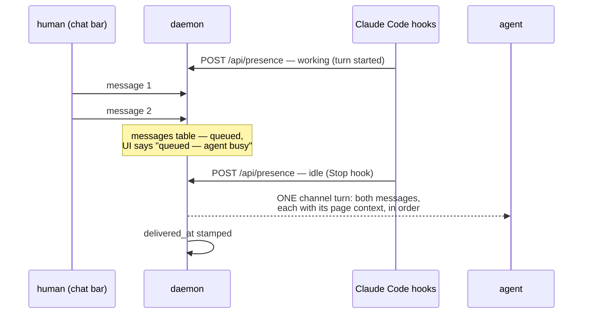

# ADR-011: Presence and patience — queue messages while the agent works, flush when it's free

**Status:** accepted (2026-07-18, review `dec_57497c931ec34176a45a`; implementation PR #21) · **Date:** 2026-07-18 · **Project:** librarian · **Read time:** ~3 min

## TL;DR

- **Decision:** the daemon learns whether the agent is **working or idle**; while it works, chat-bar messages **queue durably** instead of pushing; when it goes idle, the whole queue flushes as **one batched channel turn**.
- **Why:** today every message interrupts mid-turn, one push each — and worse, a message with no listener vanishes while the UI shows "✓ sent" (it happened tonight). Queuing fixes the interruptions *and* the lie.
- **Verdicts are exempt:** a verdict pushes immediately, always — it is usually the very thing the agent is blocked on.

## The mechanics, drawn

## Decision

1. **Presence comes from two Claude Code hooks, not guesswork.**
   `UserPromptSubmit` reports working; `Stop` reports idle — each a one-line
   fire-and-forget `curl` to `POST /api/presence {state, session}`. **Two
   loopback calls per turn, ~10 ms each, zero tokens** (hooks never touch the
   model). `PreToolUse` was considered and rejected: it fires on every tool
   call — hundreds of heartbeats a session for no better signal. Presence
   expires (TTL ~2 min without a heartbeat → unknown), so a crashed session
   can never hold the queue hostage.
2. **Messages become durable rows.** A `messages` table (body, context,
   created_at, delivered_at) replaces fire-and-forget. This is the fix for
   tonight's silent loss: the UI can now say **"queued — agent busy"** or
   **"delivered"** truthfully, because both are facts in the store.
3. **Flush is one turn, not many.** On idle (or when presence is unknown —
   today's behavior), pending messages deliver as a single channel turn,
   ordered, each labeled with its page context. One interruption carrying
   everything the human said, instead of an interruption per thought.
4. **Verdicts never queue.** Approve/reject/changes push immediately regardless
   of presence — the agent may be mid-turn *waiting* on exactly that ruling.

## What this deliberately does not do

- No mid-turn injection suppression on the Claude Code side — the daemon
  controls when it *sends*, which is the half it owns.
- No read-receipts from the agent (delivered ≠ acted-on); ADR-010's outcome
  comments already cover the acted-on half for decisions.
- No cross-device queue — that is ADR-003's mailbox; this queue is loopback,
  same trust boundary as everything else.

## Cost and setup — the two review questions, answered

- **Token cost: zero, and batching is a net saving.** Hooks are local shell
  commands; they never reach the model. The batching itself *reduces* token
  spend: N separate mid-turn interruptions become one channel turn, so fewer
  context injections per session.
- **Runtime cost: two ~10 ms loopback curls per turn.** Nothing per tool call
  (PreToolUse rejected above), nothing continuous.
- **Setup: optional, automated, and safe to skip.** With no hooks installed,
  presence reads unknown and behavior is exactly today's — nothing breaks for
  a fresh user. Opting in is `librarian install --hooks`: it merges the two
  entries into `~/.claude/settings.json` (never clobbers existing hooks) and
  `librarian uninstall` removes them. No manual JSON editing, ever.

## Consequences

- **Buys:** batched, polite delivery; zero message loss; an honest chat-bar
  status; and the `messages` table becomes the natural substrate if the
  ADR-003 outbox ever needs a local twin.
- **Costs:** one new table + one endpoint + the optional hooks installer;
  presence is best-effort — with hooks absent, behavior is exactly today's.

## Open questions for review

- Should the batch flush also include verdicts-that-happened-while-working as
  a recap line, even though they were already pushed? (Cheap, maybe noisy.)
- TTL length for presence expiry — 2 minutes proposed.

## Related

ADR-002 (delivery chain — this adds a scheduling layer to one transport) ·
ADR-003 (mailbox — the remote sibling of this local queue) · ADR-010 (outcome
comments — the acted-on half of the conversation) · PR #14 (the chat bar this
schedules).
