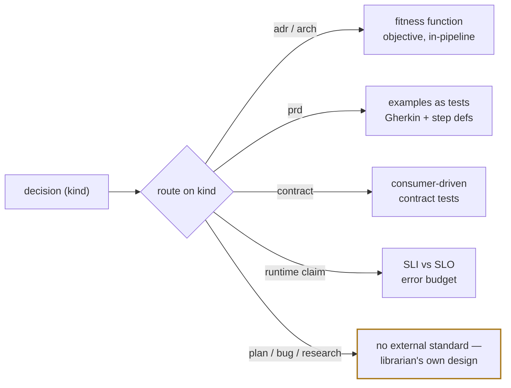

# ADR-012: Verification is type-routed — each artifact gets the check its kind deserves

**Status:** proposed (v2) · **Date:** 2026-07-19 · **Project:** librarian · **Read time:** ~5 min

## What changed in v2

v1 said: *periodically audit every accepted ADR against the code, with an agent
reading the doc and grepping.* Research (25 primary sources, 23/25 claims
verified) says that is **one row of a bigger table**. "Still correct" means
something different for a PRD than for an ADR than for a bug fix, and each has
its own method — so the unit of design is a **router**, not an audit.

It also killed two mechanisms v1 would plausibly have reached for, and found
**no evidence at all** for three of librarian's own artifact kinds. Both are
recorded below rather than papered over.

## TL;DR

- **Decision:** verification **routes on `kind`** — the field librarian already
  stores on every decision. An `adr` is checked by a fitness function; a `prd` by
  its examples; a `bug` by a regression test. One-size-fits-all was the v1 error.
- **Deterministic first, judgment last.** Where "valid" reduces to a comparison,
  a machine owns it. LLM judgment is for *authoring the criteria* and for the
  kinds that have no deterministic check — never for declaring `verified`.
- **Say what we don't know.** Three kinds have no external evidence, and two
  popular mechanisms were refuted. Those are marked, not guessed.

## The router

## Type → method, with how much to trust each row

| librarian `kind` | "Still correct" means | Method | Automatable | Evidence |
|---|---|---|---|---|
| `adr`, `arch` | the code still honors the decided characteristic | **Architecture fitness functions** — an objective, automatable integrity assessment, run continuously in the deployment pipeline | mostly | **high** — Ford/Parsons/Kua; ThoughtWorks |
| `prd` | the shipped thing still satisfies the stated example | **Specification by Example** → Gherkin scenarios that are simultaneously spec, docs, and test | yes, once step definitions exist | **high** — Adzic; Cucumber |
| (interfaces) | the messages both sides send still conform | **Consumer-driven contract tests** (Pact) — contract generated from real consumer usage | yes | **high** — Pact docs |
| (runtime) | production still behaves as decided | **SLI / SLO / error budget** — good events ÷ total, compared to a target | yes *(execution only)* | **high** — Google SRE |
| (threat model) | claimed mitigations are actually present | attestation compared against **expectations**, SLSA-style | partly | **analogy only** — SLSA checks build provenance, *not* whether a control is implemented |
| `plan` | the steps actually executed | — | — | ⚠️ **no evidence found** |
| `bug` | it is fixed **and stays** fixed | — | — | ⚠️ **no evidence found** |
| (research) | claims still true, sources still resolve | — | — | ⚠️ **no evidence found** |

**The operational recipe** for the first row, from the primary source:
(1) identify the important architectural dimensions, (2) define fitness functions
that check compliance for each, (3) run them automatically in a deployment
pipeline. The *dependency-drift* fitness function is the canonical small instance.

## Two mechanisms we must NOT lean on

Both were refuted 0–3 under adversarial verification. Recording them so nobody
re-proposes them from intuition:

> ⛔ **SLSA hash-equality as a "fully automated" correctness check.** SLSA
> verifies build-provenance metadata — origin, signatures, digests — *not*
> whether a security control exists in the code. Useful analogy, not a validator.

> ⛔ **OPA / policy-as-code as "the core mechanism"** for deterministic ADR or
> threat-model conformance. Policy-as-code may still be viable, but the surviving
> evidence does not support it as the backbone. Don't build on it without better
> grounding.

## Where the LLM is allowed to speak

The research found **no external standard** for an LLM acting as a type-aware
validator — that layer is ours to design, so we design it conservatively:

1. **The LLM may classify and route.** Picking "this is an `adr`, check it with a
   fitness function" is judgment it is good at, and a wrong route is visible.
2. **The LLM may draft the criteria** — propose the fitness function, write the
   Gherkin, name the invariant. A human or a test then owns it.
3. **The LLM may NOT declare `verified` on its own reading.** A verdict of
   `verified` requires a deterministic artifact: a check that ran, a test that
   passed, a `file:line` that exists. Grounded evidence or it doesn't count
   (v1 got this right — it is retained).
4. **`drifted` is a report, never a repair.** The agent reports; the human rules
   which side moves — code or record. An agent must never silently "fix" either
   to make an audit pass.

The distinction that makes this safe: **judgment upstream, determinism at the
verdict.** Choosing an SLI is judgment; comparing it to the target is not. Writing
an example is judgment; running it is not.

## Decision

1. **Route on `kind`.** Verification dispatches on the field already stored; each
   kind names its method and its evidence bar.
2. **Adopt the four grounded rows now** (`adr`/`arch` → fitness functions,
   `prd` → examples-as-tests, contracts → Pact-style, runtime → SLO). Express
   them so they are machine-checkable: a characteristic + an executable check;
   Given/When/Then + step definitions; a generated contract; an SLI + target.
3. **Treat `plan`, `bug`, and research docs as open design**, explicitly marked
   as unresearched rather than given a plausible-looking check. First guesses to
   *test*, not assume: a plan is verified by its steps' artifacts existing; a bug
   by a regression test that fails on the old commit.
4. **Never rely on the two refuted mechanisms** without new evidence.
5. **Cadence: on demand first.** Automation earns its schedule after the practice
   proves out — unchanged from v1.

## Consequences

- **Buys:** `get_constraints` stays trustworthy over time; each kind gets a check
  that can actually fail; the honest gaps are visible instead of hidden behind a
  uniform "audited" badge.
- **Costs:** four methods to support instead of one; docs must state claims
  concretely enough to check; three kinds have no answer yet.
- **First sweep on acceptance:** librarian's own `adr`-kind decisions, using the
  only row we can run today — grounded reading with `file:line` evidence — while
  the real fitness functions are written.

## Related

ADR-010 (outcome at verdict time — this is the same honesty, re-checked later) ·
ADR-008 (provenance vs authority — a drifted "accepted" is the temporal twin of
an unbacked "approved") · ADR-014 (imported third-party docs are untrusted
content — a validator must not treat them as claims about *our* code) ·
BUG-001 (the library must not look complete when it isn't; here, must not look
*true* when it isn't).

**Sources:** [Building Evolutionary Architectures](https://nealford.com/books/buildingevolutionaryarchitectures.html) · [ThoughtWorks — architectural fitness function](https://www.thoughtworks.com/radar/techniques/architectural-fitness-function) · [Specification by Example](https://gojko.net/books/specification-by-example/) · [Gherkin reference](https://cucumber.io/docs/gherkin/reference/) · [Pact](https://docs.pact.io/) · [Google SRE — implementing SLOs](https://sre.google/workbook/implementing-slos/)
