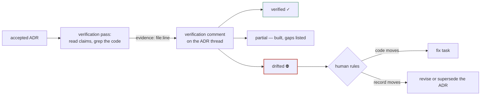

# ADR-012: Decisions get audited against the code — every accepted ADR is verified, with evidence

**Status:** proposed · **Date:** 2026-07-18 · **Project:** librarian · **Read time:** ~3 min

## TL;DR

- **Decision:** every **accepted** ADR gets a periodic verification pass: an agent reads the decision, checks the codebase for its claims, and posts a **verification comment with file:line evidence** on the ADR's own thread — `verified`, `partial`, or `drifted`.
- **Why:** ADR-010 records what the agent *said* it did at verdict time. Nothing checks what the code says *six weeks later*. An accepted ADR that reality has drifted away from is worse than no ADR — it is confident misinformation served by `get_constraints`.
- **On drift, one of the two moves:** fix the code, or revise/supersede the ADR. The record and reality must match; which one moves is the human's ruling.

## The loop, drawn

## Decision

1. **Scope: accepted ADRs only.** Proposed ones aren't promises yet; rejected
   ones are red lights, not claims about the code.
2. **Every verification is grounded, never vibes.** Each ADR's checkable claims
   are verified against the actual tree — e.g. ADR-009 claims "vendored mermaid,
   no CDN" → `public/vendor/mermaid.min.js` exists and no external `<script src>`
   in the UI; ADR-007 claims the loopback gate → the `isLoopback` refusal in
   `daemon.ts`. Evidence is file:line or it doesn't count.
3. **The result lands on the thread** (ADR-010's channel): a comment stating
   `verified` / `partial` / `drifted`, claim by claim, with evidence. The thread
   stays the single audit trail: decision → verdict → outcome → **verification**.
4. **`drifted` is a human decision point, not an agent fix.** The agent reports;
   the human rules which side moves — code (a fix task) or record (revision via
   `parent_review_id`, or supersede). An agent must never silently "fix" either
   side to make the audit pass.
5. **Cadence: on demand first.** A verification pass is run when asked (per ADR
   or all-accepted sweep). Automation (post-release, cron) is a later decision —
   the practice must earn its cost before it gets a schedule.

## What this is not

- Not CI: tests check behavior the code claims; this checks the code against
  what the *decisions* claim. Both can be green while disagreeing with each other.
- Not re-review: the verdict stands; verification asks whether reality still
  honors it.
- Not a new mechanism: `comment_on_decision` + grounded reading is everything
  required. This ADR adds an obligation and a vocabulary, zero code paths.

## Consequences

- **Buys:** `get_constraints` answers become trustworthy over time, not just at
  verdict time; the three ADR-010 failure modes gain their missing detector
  ("acted, but differently than approved" is only findable by audit).
- **Costs:** one agent pass per sweep; ADRs must state claims concretely enough
  to check (they already do — the house style is file:line grounded).
- **First sweep:** on acceptance of this ADR, librarian's own ADR-001…011 get
  the inaugural verification pass — eleven decisions, evidence or drift.

## Related

ADR-010 (outcome at verdict time — this is the same honesty, re-checked later) ·
ADR-008 (provenance vs authority — a drifted "accepted" is the temporal twin of
an unbacked "approved") · BUG-001 (the library must not look complete when it
isn't; here, must not look *true* when it isn't).
