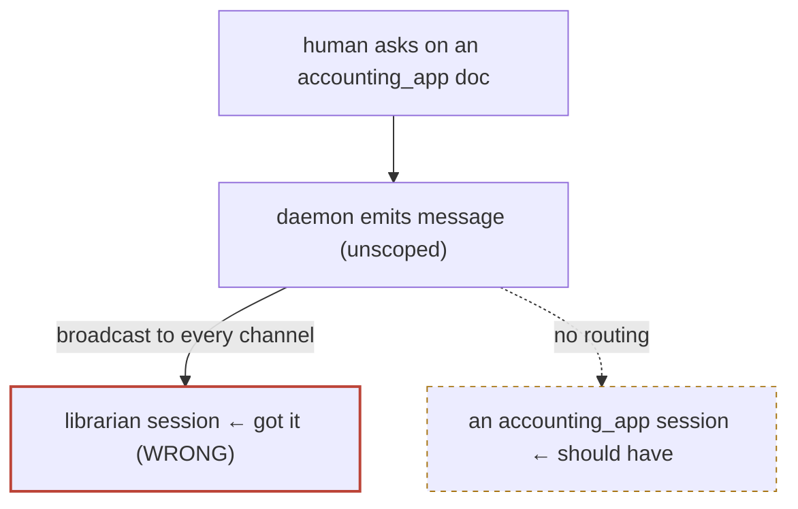
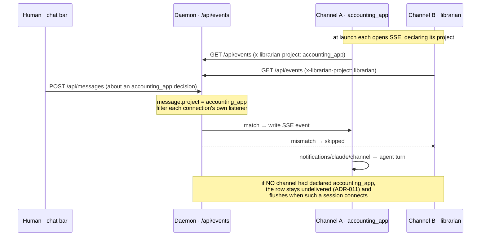

# ADR-013: A message finds the right session — route by project, never lose it

**Status:** proposed · **Date:** 2026-07-18 · **Project:** librarian · **Read time:** ~3 min

## TL;DR

- **Bug that forced this:** a chat-bar question about *accounting_app* was delivered to the *librarian* session, because the message stream is unscoped (ADR-007 **T4**) — it broadcasts to every channel-connected agent, and there happened to be exactly one.
- **Decision:** a message carries a **target project**; each session's channel declares **its** project; the channel delivers a message only when the target matches (or the message is deliberately global).
- **Never lost:** if no matching session is connected, the message stays a durable row (ADR-011) and is delivered when a matching session appears — a question waits for the right agent instead of hitting the wrong one.

## The bug, drawn

## Decision

1. **A message has a target project.** Derived automatically: a message about a
   decision inherits that decision's project (the picker and decision pages
   already know it); a catchup "this page" message with no decision is
   **global** (broadcast, as today).
2. **A session declares its project.** The channel server learns it from its
   launch working directory (basename of `cwd`), overridable by
   `LIBRARIAN_PROJECT`, and reports it on the presence heartbeat (ADR-011).
3. **The channel declares its project on the SSE connection; the daemon filters
   per-connection.** The channel server opens `/api/events` with a header
   `x-librarian-project: <its project>`. The daemon's SSE handler already gives
   every connection its own writer and its own listener closure — routing is a
   one-line filter inside that closure: a `message` with a `project` is written
   only to connections whose declared project matches; a global message (no
   project) goes to all. No registry, no bookkeeping — the connection's listener
   *is* the per-session state, and its `req.on('close')` cleanup already exists.

       app.get('/api/events', (req, res) => {
         const mine = req.header('x-librarian-project');
         const onEvent = (e) => {
           if (e.type === 'message' && e.project && mine && e.project !== mine) return;
           res.write(`data: ${JSON.stringify(e)}\n\n`);
         };
         bus.on('event', onEvent);
         req.on('close', () => bus.off('event', onEvent));
       });

4. **Undeliverable ≠ lost.** A targeted message with no matching connected
   session stays undelivered in the `messages` table (ADR-011). It flushes when
   a session for that project connects, and the catchup surfaces "N messages
   waiting for a *project* session" so the human knows it's parked, not gone.

## How it actually works, drawn

Two sessions are open — one in `accounting_app`, one in `librarian`. Each
declared its project when its channel opened the SSE stream. A question asked on
an accounting_app doc reaches only the accounting_app agent:

The daemon never "chooses" a session — it writes to every connection whose own
declared project matches, and each connection is a separate `res` it already
holds. Global messages (no project) skip the filter and reach all.

## Why per-connection server-side filtering (v2 correction)

v1 chose *client-side* filtering (broadcast to all, each channel drops what
isn't its project) and argued against server-side routing because it "needs a
session registry and connect/disconnect bookkeeping." **That was wrong for SSE.**
Each `/api/events` connection already has its own listener closure and its own
`close` cleanup, so per-connection filtering needs no registry at all — it is
the same amount of code as client-side, and strictly better: a session only ever
receives *its own* messages on the wire, not everyone's. The reviewer's "how,
technically?" question surfaced this; v2 adopts it.

## What this is not

- Not per-*session* addressing (you can't target one specific window) — project
  is the routing unit, which is what "the right Claude session" means in
  practice. Session-level targeting is a later decision if it's ever wanted.
- Not cross-device (ADR-003's mailbox) — this is loopback routing between local
  sessions.

## Consequences

- **Buys:** a question reaches an agent with the right project's context;
  the librarian session stops being a catch-all; messages survive "no one's
  home."
- **Costs:** the channel server needs its project at launch (`claude-lib` can
  export `LIBRARIAN_PROJECT=$(basename $PWD)`); a global message still reaches
  everyone (intended — some things are for whoever's listening).
- **Closes ADR-007 T4** for the message path; the verdict path is next (a
  verdict is inherently project-scoped too).

## Related

ADR-007 (T4, the unscoped stream this closes) · ADR-011 (durable queue — the
"never lost" guarantee) · ADR-003 (the remote sibling: mailbox routing across
devices) · PR #24 (the context picker that already names a target).
