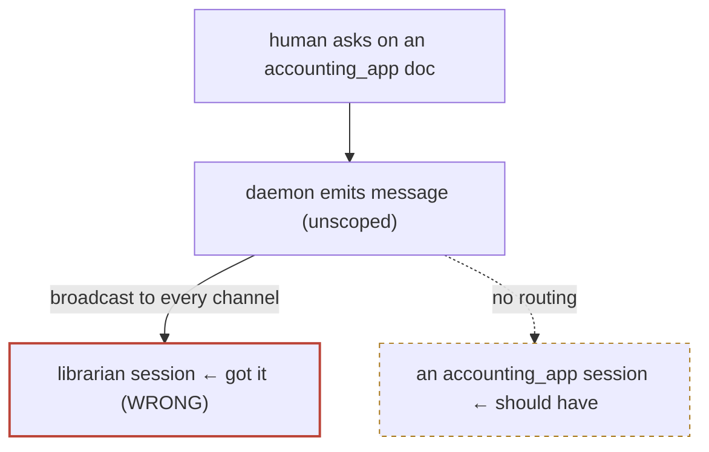

# ADR-013: A message finds the right session — route by project, never lose it

**Status:** proposed · **Date:** 2026-07-18 · **Project:** librarian · **Read time:** ~3 min

## TL;DR

- **Bug that forced this:** a chat-bar question about *accounting_app* was delivered to the *librarian* session, because the message stream is unscoped (ADR-007 **T4**) — it broadcasts to every channel-connected agent, and there happened to be exactly one.
- **Decision:** a message carries a **target project**; each session's channel declares **its** project; the channel delivers a message only when the target matches (or the message is deliberately global).
- **Never lost:** if no matching session is connected, the message stays a durable row (ADR-011) and is delivered when a matching session appears — a question waits for the right agent instead of hitting the wrong one.

## The bug, drawn

## Decision

1. **A message has a target project.** Derived automatically: a message about a
   decision inherits that decision's project (the picker and decision pages
   already know it); a catchup "this page" message with no decision is
   **global** (broadcast, as today).
2. **A session declares its project.** The channel server learns it from its
   launch working directory (basename of `cwd`), overridable by
   `LIBRARIAN_PROJECT`, and reports it on the presence heartbeat (ADR-011).
3. **Filtering is client-side, in each channel.** Each channel server forwards a
   message to its agent only when `message.project` is null (global) or equals
   its own project. This respects the one-session-one-channel model — no daemon
   session registry, no fan-out logic — and a session simply ignores what isn't
   its business.
4. **Undeliverable ≠ lost.** A targeted message with no matching connected
   session stays undelivered in the `messages` table (ADR-011). It flushes when
   a session for that project connects, and the catchup surfaces "N messages
   waiting for a *project* session" so the human knows it's parked, not gone.

## Why client-side filtering

The alternative — the daemon tracking which live session serves which project
and unicasting — needs a session registry, connect/disconnect bookkeeping, and
a fan-out policy for "two accounting_app sessions." Client-side filtering needs
none of it: the daemon broadcasts (as it does now), and each channel already
runs per-session, so it is the natural place to know "am I the right recipient?"
The cost is every channel sees every message's *envelope* — acceptable on a
loopback box (same trust boundary as everything else), and the body still only
becomes an agent turn for the matched session.

## What this is not

- Not per-*session* addressing (you can't target one specific window) — project
  is the routing unit, which is what "the right Claude session" means in
  practice. Session-level targeting is a later decision if it's ever wanted.
- Not cross-device (ADR-003's mailbox) — this is loopback routing between local
  sessions.

## Consequences

- **Buys:** a question reaches an agent with the right project's context;
  the librarian session stops being a catch-all; messages survive "no one's
  home."
- **Costs:** the channel server needs its project at launch (`claude-lib` can
  export `LIBRARIAN_PROJECT=$(basename $PWD)`); a global message still reaches
  everyone (intended — some things are for whoever's listening).
- **Closes ADR-007 T4** for the message path; the verdict path is next (a
  verdict is inherently project-scoped too).

## Related

ADR-007 (T4, the unscoped stream this closes) · ADR-011 (durable queue — the
"never lost" guarantee) · ADR-003 (the remote sibling: mailbox routing across
devices) · PR #24 (the context picker that already names a target).
