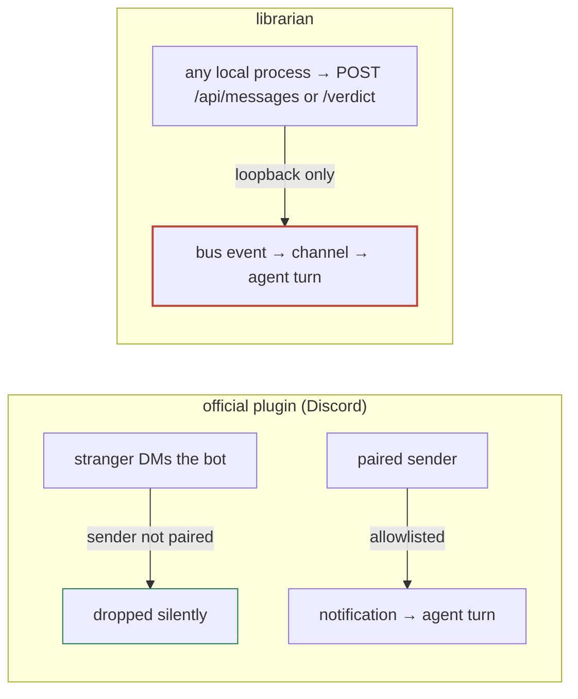

# ADR-014: Channel security — do we have the holes the Discord plugin plugs?

**Status:** proposed · **Date:** 2026-07-18 · **Project:** librarian · **Read time:** ~5 min

## TL;DR

- Librarian's channel is **modeled on Anthropic's official channel plugins** (Discord/Telegram/fakechat). Those plugins exist to defend one thing: **a channel turns outside text into an agent turn, so an ungated channel is a prompt-injection vector.**
- **We share the core exposure but a narrower surface.** Their headline mitigation — a **per-sender allowlist bootstrapped by pairing** — we replace with the **loopback gate** (ADR-007). Under single-user/local that is defensible; it is *not* the same guarantee, and it should be named, not assumed.
- **Three concrete gaps** worth acting on: (1) we inject verdict/message text **unsanitized** where the official clients now scrub it; (2) we have a **real untrusted-content path they don't** — rescanned vendor-repo docs; (3) a **red line** — never declare `claude/channel/permission` without real sender auth.

## What the official plugins actually defend against

Straight from the channels reference — the threat and their fix, in their words:

> "An ungated channel is a prompt injection vector. Anyone who can reach your endpoint can put text in front of Claude."

Their mitigations, in order of importance:

1. **Gate on the *sender*, not the room.** Check `message.from.id` against an allowlist **before** emitting the notification; drop non-members silently. Gating on the room/chat id is explicitly called a bug — anyone in an allowlisted group could inject.
2. **Bootstrap the allowlist by pairing.** DM the bot → it replies a pairing code → the human approves it in their Claude Code session → that platform id is added. Then switch policy from `pairing` to `allowlist` so strangers stop getting codes.
3. **Permission relay is opt-in and gated.** A channel may declare `claude/channel/permission` to approve/deny tool use remotely — but the docs are blunt: *"Only declare the capability if your channel authenticates the sender, because anyone who can reply through your channel can approve or deny tool use in your session."*
4. **Treat relayed fields as untrusted.** Clients (v2.1.211+) sanitize `description`/`input_preview`: neutralize direction-override + invisible characters, quote look-alikes, fold whitespace, cap length. *"Treat both fields as untrusted unless you control the client fleet."*
5. **Bind loopback.** The reference webhook binds `127.0.0.1` — nothing off-box can POST.

## The injection path, drawn

The official plugin has **two** gates (reachability *and* sender identity). Librarian has **one** (reachability = loopback). Inside loopback there is no per-sender check — the trust boundary is "any process running as you," exactly as ADR-007 states.

## Do we have the same problem? Threat-by-threat

| Their threat | Their mitigation | Librarian today | Same hole? |
|---|---|---|---|
| Ungated endpoint = anyone injects a turn | Per-sender allowlist + pairing | **Loopback gate only** (+ optional `/api` token); no sender identity, no pairing | **Narrower, not closed.** No public platform, but any local process can inject |
| Room-based gating lets group members in | Gate on sender, never room | No rooms; `/api/events` scoped by **self-declared** `x-librarian-project` (ADR-013) | Related: **routing ≠ authorization** — a self-declared header is not a sender check |
| Remote tool approval is dangerous | `claude/channel/permission` only if sender-authenticated | **We do NOT declare it** — push-only | ✅ **Avoided** (keep it that way) |
| Relayed text is untrusted (bidi/invisible/length) | Client sanitizes `description`/`input_preview` | Verdict reason + chat body injected **verbatim**, labeled "data not instructions", **unsanitized** | ⚠️ **Same class**, unmitigated |
| Untrusted *source* of channel text | Single-user DM, paired senders only | **Rescan imports vendor-repo docs** as decisions; that text can reach the agent | ⛔ **Novel path we have and they don't** |
| Endpoint exposed to the network | Bind `127.0.0.1` | Daemon loopback-only; refuses non-loopback without a token | ✅ **Already present** (ADR-007 gate) |
| Dev flag runs an unapproved channel | Self-authored only; "don't run untrusted sources" | `librarian-channel` is our own code | ✅ **Same posture** (ADR-007 T3) |

## The one genuinely new risk — untrusted imported content

The Discord plugin's world is a single human DMing a bot. Librarian has a path they don't: **`POST /api/scan` walks vendor repos and imports their `docs/*.md` as decisions** (this already flooded the library with monetr / claude-trading-skills docs). That content is authored by *third parties*, and it can be surfaced back to the agent — through a catchup, a search result, or a message that references the decision. A hostile `docs/ADR.md` in a scanned dependency is a **stored prompt-injection payload** aimed at whatever agent later reads it.

The official mitigation for untrusted text (sanitize on the way in) maps directly onto this — and matters more for us than for them.

## Decision

1. **⛔ Never declare `claude/channel/permission`.** Librarian's channel stays **push-only** (verdicts + messages). Remote tool-approval requires per-sender authentication we deliberately do not have. This is a standing red line, not a TODO.
2. **⚠️ Sanitize channel-injected text (defense-in-depth).** Neutralize Unicode direction-override + invisible characters and cap length on the strings that become an agent turn — verdict `reason`, chat `body`, and any decision content surfaced through the channel. Mirrors what the official clients now do to relayed fields. Cheap, and it is the direct mitigation for the imported-doc path.
3. **Keep the loopback gate as our sender-auth substitute — and say so.** For single-user/local, loopback + the optional `/api` token *is* our "who may inject" boundary. We do **not** build pairing/per-sender allowlists — that is over-engineering for a one-person machine, and the [ADR-004] verdict-auth work is the real answer the day we go multi-party. Document that `/api/messages` and `/api/decisions/:id/verdict` are un-authenticated *per sender* by design under loopback.
4. **Treat imported (watcher/rescan) docs as untrusted-origin.** At minimum sanitize per (2); consider marking scanned-in decisions with their provenance so the agent knows a doc came from a third-party repo, not from this project.

## What this is not

- Not a reversal of ADR-007 — it's the missing half: ADR-007 covered the *forged-verdict* blast radius; this covers the *injected-text* surface the reference plugins are built around.
- Not multi-user auth — that's [ADR-004] (verdict authenticates itself) and ADR-003 (per-participant scoping).

## Consequences

- **Buys:** parity with the official channel threat model on the axes that matter for a local tool; a concrete defense for the imported-doc injection path; a written red line around permission relay before anyone is tempted to add "approve from your phone."
- **Costs:** a small sanitiser on the inject path; provenance surfacing on imported docs is a follow-up.
- **First step if accepted:** add the sanitiser to `messageToChannel` / `verdictToChannel` and the message post path; add a BUG or ADR-012-style check that no code declares `claude/channel/permission`.

## Related

ADR-007 (channel threat model — the forged-verdict half) · ADR-004 (verdict authenticates itself — the real multi-party gate) · ADR-013 (routing — delivery, explicitly *not* authorization) · BUG-001 / `POST /api/scan` (the vendor-doc import that creates the untrusted-content path).

**Sources:** [Channels reference — Gate inbound messages / Relay permission prompts](https://code.claude.com/docs/en/channels-reference) · [Official Discord plugin](https://github.com/anthropics/claude-plugins-official/blob/main/external_plugins/discord/README.md) · [Claude Code security](https://code.claude.com/docs/en/security)
