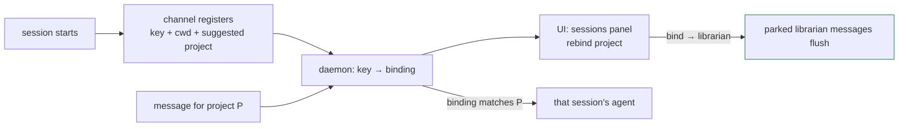

# ADR-016: A session registers with a key — bind the project, stop guessing from cwd

**Status:** proposed · **Date:** 2026-07-19 · **Project:** librarian · **Read time:** ~4 min

## TL;DR

- **The bug:** ADR-013 derives a session's project from `basename(cwd)`. That is a *guess*, and it is wrong whenever you work on one project from another's directory — which is the normal case here.
- **Decision:** a session **registers with a generated key** and its project is a **binding the daemon holds**, changeable from the UI — not a string inferred at spawn time.
- **Deferred (deliberately):** librarian *spawning* Claude sessions itself. It solves the mapping perfectly and is the natural end state, but it turns an injected message into new agent execution — it waits behind ADR-004.

## The bug that forced this

Live, tonight. A comment on an ADR-012 (project `librarian`) never reached the session doing the librarian work:

```
parked messages: [{ project: "librarian", count: 1 }]
```

The session runs from `~/Projects/all_state`, so its channel declared `all_state`. `all_state ≠ librarian` → filtered → **nothing anywhere declared `librarian`** → parked. Routing behaved exactly as designed; the design was wrong.

This is the mirror of the previous failure. Before ADR-013: undeclared channels caught *everything*. After: a mis-derived project catches *nothing*. Both are symptoms of the same root cause — **the daemon was never told the mapping, it guessed.**

## Why cwd was always going to fail

`basename(cwd)` conflates three different things:

| Thing | Actually is |
|---|---|
| Where the session was launched | a directory |
| What the session is working on | one or more **projects** |
| Which agent should get a message | a **session**, addressed deliberately |

They coincide often enough to look correct in testing, and diverge exactly when it matters. A guess also fails *silently* in both directions, which is why both bugs cost hours of process archaeology (`ps`, `lsof`) instead of being visible.

## Decision

**1. Every session registers with a key.** At startup the channel generates `ses_<random>` (or uses `LIBRARIAN_SESSION_KEY` if it was given one) and presents it on connect, along with its cwd and its *suggested* project:

```
GET /api/events
  x-librarian-session: ses_9f2a…
  x-librarian-cwd:     /Users/x/Projects/all_state
  x-librarian-project: all_state      ← now only a DEFAULT, not the truth
```

**2. The daemon holds the binding, and the human can change it.** The registry maps `sessionKey → { cwd, project, connectedAt }`. The cwd-derived name seeds it; the UI can rebind at any time. Binding a session to `librarian` immediately flushes anything parked for `librarian`.

**3. Connected sessions become visible.** A panel listing every live session — key, cwd, bound project, last seen — with a dropdown to rebind. Today visibility is *zero*: diagnosing both routing bugs required inspecting OS processes. A message that cannot be delivered must be obvious, not archaeological.



**4. Required change — the filter must read the binding live.** Today `/api/events` captures the project *once* at connect (`const mine = req.header(...)`) and freezes it in the listener closure, so a rebind could never take effect. The filter must look the binding up by session key per event. Small change, but it is the whole feature.

**5. A session may hold more than one project.** `LIBRARIAN_PROJECT=librarian,all_state` — the binding is a set, and the filter matches any member. One session legitimately touches several projects; that is the case that broke us.

## The other half — librarian starting sessions

Correct instinct, and the natural end state: **if librarian spawns the session, it sets the key and the project itself, so the mapping cannot be wrong by construction.** It would also fix "nobody's home" — a comment on a TreeWalk doc could *wake* a TreeWalk agent instead of parking.

Deferring it, for reasons that are about blast radius, not effort:

- ⛔ **It converts an injected message into new agent execution.** ADR-014 established the channel is a prompt-injection surface whose only gate is loopback, and that `POST /api/scan` imports third-party vendor docs as decisions. A daemon that can *spawn agents with tool access* in response to that content is a categorically larger risk than one that can only deliver text. This belongs behind **ADR-004** (verdict/message authenticity).
- The daemon would be automating `--dangerously-load-development-channels` on the human's behalf.
- Lifecycle: who owns, watches, and reaps a spawned session; where its output goes; what happens when it hangs.
- Unattended spawning spends tokens with no human in the loop.

**If built later, the conditions are:** ADR-004 shipped · spawning is **human-confirmed** ("no `librarian` session is connected — start one?"), never silent · the spawned session is visible and reapable in the sessions panel.

## Consequences

- **Buys:** the mapping is *stated*, not guessed, so neither over-delivery nor over-filtering can happen silently; multi-project sessions work; parked messages become visible and recoverable; per-session addressing (which ADR-013 explicitly deferred) becomes possible.
- **Costs:** a registry entry per connection and a real disconnect path; the SSE filter stops being a captured constant; a small UI surface.
- **Supersedes** ADR-013's project derivation — routing itself (per-connection filtering, durable parking) stands unchanged; only *how a session gets its project* changes.

## Related

ADR-013 (routing — this replaces its cwd guess) · ADR-014 (why the spawn half waits: the channel is an injection surface) · ADR-004 (the gate for anything that turns a message into execution) · ADR-011 (the durable queue that made the parked message recoverable instead of lost).
